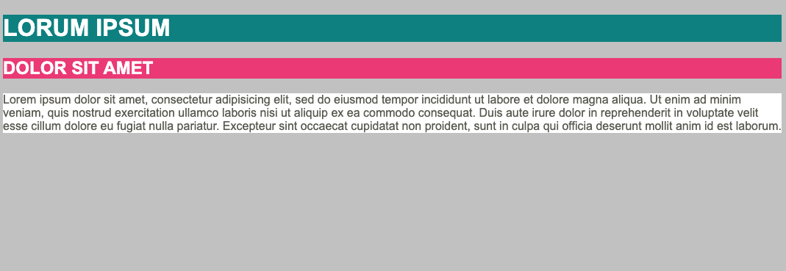

# background

Bouw de opmaak uit `opgave.png` na.

* index.html
  * plaats in een `main`-element een `h1`, een `h2` en een paragraaf met wat "lorem ipsum" dummytekst
* vul de stylesheet in
  * het body-element krijgt een font-family van Arial, met een fall-back naar Helvetica en eender welk sans-serif font, en `#c8c8c8` als achtergrondkleur
  * de titels `h1` en `h2` krijgen allebei witte tekst die automatisch in hoofdletters wordt geplaatst. Schrijf die gemeenschappelijke stijlregels **één keer** met een gegroepeerde selector (`h1, h2`) in plaats van ze te herhalen.
  * daarna geef je elke titel apart nog een eigen achtergrondkleur:
    * h1: `darkcyan`
    * h2: `#ee3e80`
  * de paragraaf krijgt een witte achtergrond en `#64645a` als tekstkleur

## Verwacht resultaat

