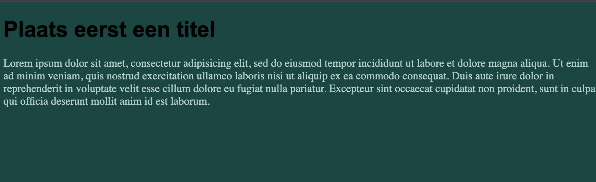

- plaats in het document een titel en een paragraaf met wat "lorem ipsum" dummytekst
- verander de achtergrondkleur van het body-element naar #004643
- zet het lettertype voor de titel op ‘Arial’
- de kleur van de paragraaftekst zet je op #abd1c6

## Verwacht resultaat

