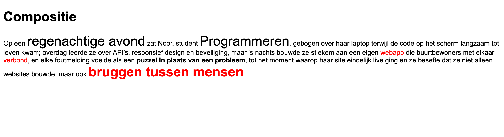

Zet de volgende tekst in een `p`-tag

```
Op een regenachtige avond zat Noor, student Programmeren, gebogen over haar laptop terwijl de code op het scherm
langzaam tot leven kwam; overdag leerde ze over API’s, responsief design en beveiliging, maar ’s nachts bouwde ze
stiekem aan een eigen webapp die buurtbewoners met elkaar verbond, en elke foutmelding voelde als een puzzel in
plaats van een probleem, tot het moment waarop haar site eindelijk live ging en ze besefte dat ze niet alleen
websites bouwde, maar ook bruggen tussen mensen.
```

* Geef alle tekst op de pagina een font-family van `Arial, Helvetica, sans-serif`.
* Maak 3 css classes aan:
  * big: geeft de tekst een font-size van 32px
  * bold: maakt de tekst vetgedrukt
  * red: geeft de tekst een rode kleur
* Zorg er nu voor dat de volgende woorden de class `big` krijgen:
  * regenachtige avond
  * Programmeren
* Zorg er voor dat de volgende woorden de class `bold` krijgen:
  * puzzel in plaats van een probleem
* Zorg er voor dat de volgende woorden de class `red` krijgen:
  * verbond
  * webapp
* Zorg er voor dat deze tekst zowel de classes `big`, `red` als `bold` krijgt:
  * bruggen tussen mensen

> Tip: met een `span`-tag kan je een deel van de tekst in een `p`-tag selecteren en daar een class aan toevoegen.
## Verwacht resultaat


