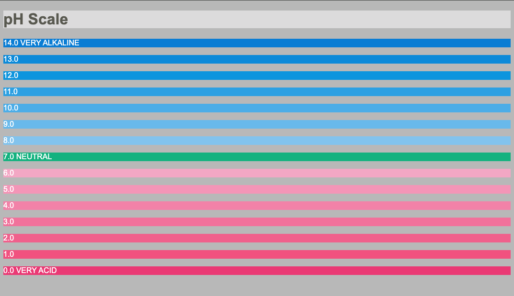

# ph-scale

Bouw de ph-schaal na met HTML en CSS. 

- Gebruik een color-picker tool om de juiste kleuren te bepalen voor de verschillende ph-waarden.
- Gebruik paragraaf-elementen voor de verschillende ph-waarden.
- Geef elke paragraaf een class die de ph-waarde benoemt: `class="zero"`, `class="one"`, `class="two"`, ... tot en met `class="fourteen"`.
- Selecteer die paragrafen in CSS met een gecombineerde type- en class-selector (dus `p.zero` en niet enkel `.zero`), zodat de stijlregel enkel geldt voor paragrafen met die class.

> TIP: De color-picker tool uit de Microsoft PowerToys suite is hiervoor heel handig! (https://learn.microsoft.com/en-us/windows/powertoys/color-picker)
> MacOS komt standaard met een color-picker tool (Digital Color Meter)

## Verwacht resultaat

