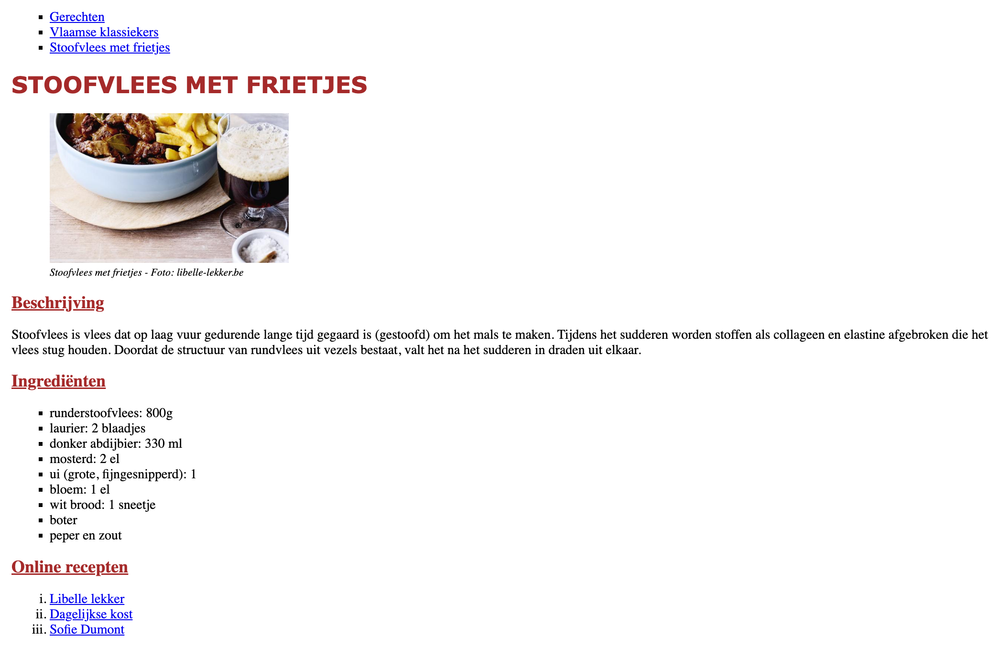

Deze oefening is een vervolg op de oefening `recipe-advanced` uit het labo 2. Kopieer eerst de HTML van deze oplossing naar hier.

* Pas de volgende styling toe:
  * alle teksten in body maken we standaard 14px
  * h1 staat in het lettertype ‘Verdana’, 24px, vet en bruin (brown) zijn en wordt automatisch in hoofdletters geplaatst
  * de ondertitels worden 18px, onderlijnd en bruin (brown)
  * de tekst bij de afbeelding is cursief en 11px groot
  * de ongeordende lijsten (`ul`) krijgen vierkante opsommingstekens
  * de genummerde lijst (`ol`) gebruikt kleine Romeinse cijfers
  * de afbeelding moet 250px breed zijn en laat de hoogte automatisch aanpassen. Gebruik hiervoor het juiste HTML attribuut.

## Verwacht resultaat

