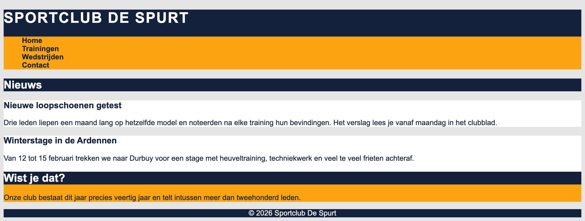

# semantic-universal

In deze oefening combineer je de **semantische tags** uit labo 1 en 2 met de **universal selector** (`*`). Bouw de opmaak uit `opgave.png` na.

* index.html
  * bouw de structuur van een basis HTML5-website met `header`, `nav`, `main`, `section`, `article`, `aside` en `footer`
  * in de `header` plaats je een `h1` met de titel "Sportclub De Spurt" en daaronder de `nav`
  * in de `nav` zet je een ongeordende lijst met vier menu-items: Home, Trainingen, Wedstrijden en Contact. Elk menu-item is een link.
  * in de `main` komt een `section` met een `h2` "Nieuws" en daarin twee `article`-elementen. Elk artikel heeft een `h3` als titel en een paragraaf met wat dummytekst.
  * naast de `section` zet je in diezelfde `main` een `aside` met een `h2` "Wist je dat?" en een paragraaf
  * de `footer` bevat enkel de tekst "© 2026 Sportclub De Spurt", zonder paragraaf eromheen
* vul de stylesheet in
  * met de **universal selector** geef je élk element op de pagina een font-family van Arial, met een fall-back naar Helvetica en eender welk sans-serif font, en `#14213d` als tekstkleur
  * daarna geef je de semantische elementen elk hun eigen achtergrondkleur, zodat de structuur van de pagina zichtbaar wordt:
    * body: `#e5e5e5`
    * header: `#14213d`
    * nav: `#fca311`
    * main: `#ffffff`
    * section: `#e5e5e5`
    * article: `#ffffff`
    * aside: `#fca311`
    * footer: `#14213d`
  * de `h1` wordt wit, staat automatisch in hoofdletters en de letters staan 2px uit elkaar
  * de `h2`-titels krijgen een achtergrondkleur `#14213d` en witte tekst
  * de tekst in de `footer` is wit en staat gecentreerd
  * de opsommingstekens van de lijst verdwijnen
  * de links zijn niet onderlijnd en staan vetgedrukt

> Let op: de universal selector selecteert **elk** element apart, ook de elementen die binnenin een ander element staan. Een kleur die je met `*` instelt, wordt dus niet "overschreven" door de kleur van een ouderelement: je moet ze opnieuw instellen op het element dat de tekst zelf bevat. Dat is ook de reden waarom de footer zijn tekst rechtstreeks bevat en niet in een `p`-element.

## Verwacht resultaat

