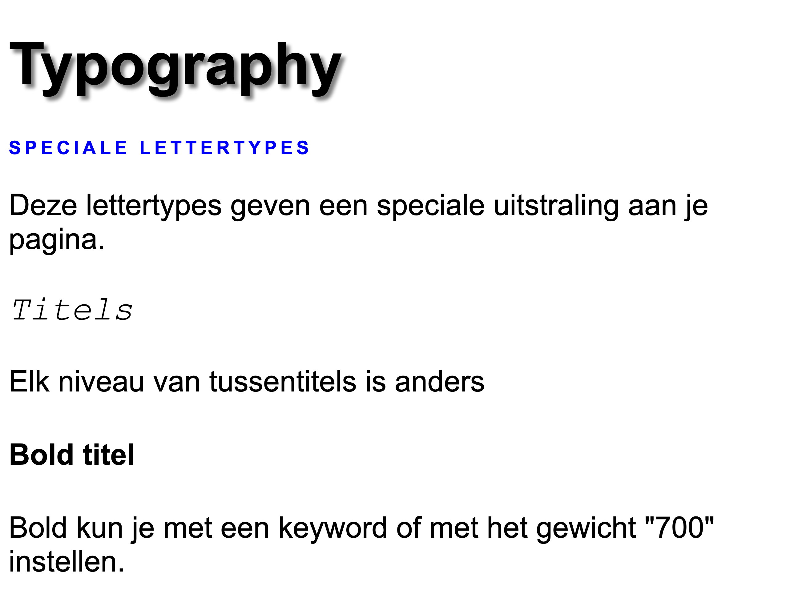

* Pas de volgende styling toe:
  * alle teksten in body geven we een font-family van Arial. Met een fall-back naar Helvetica en eender welk sans-serif font.
  * h1 heeft een schaduw van 2px horizontaal, 2px verticaal, 2px vervaging en grijs (gray) als kleur
  * h2 heeft een tekstgrootte van 10px, een blauwe kleur (blue), de letters staan 2px uit elkaar en de tekst is in uppercase (zelfs als dat niet het geval is in de HTML).
  * h3 heeft een font-family van "Courier New", een normale dikte, en is schuin gedrukt. Voorzie ook een fall-back naar Courier en eender welk monospace font.
  * h4 is bold.

## Verwacht resultaat

